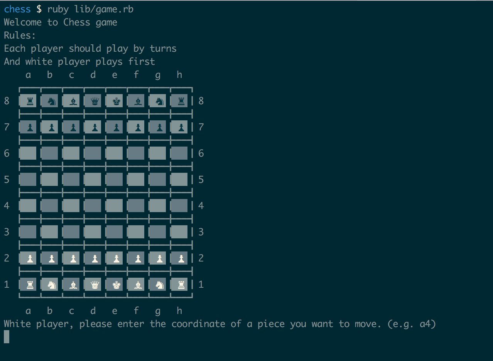
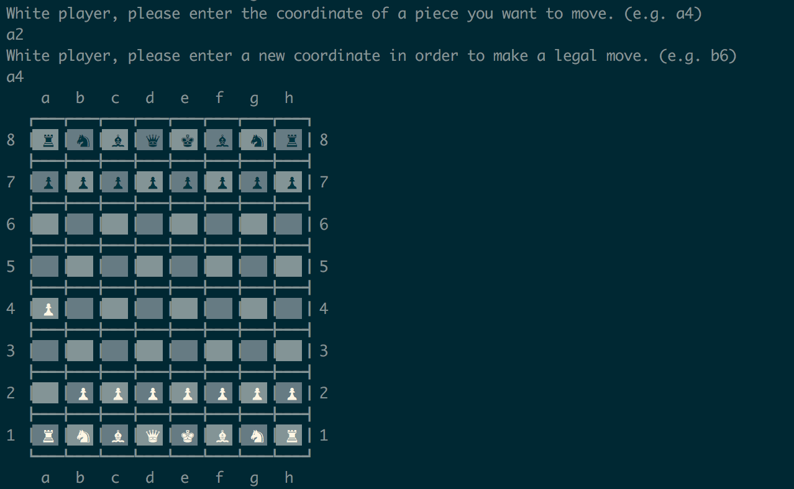
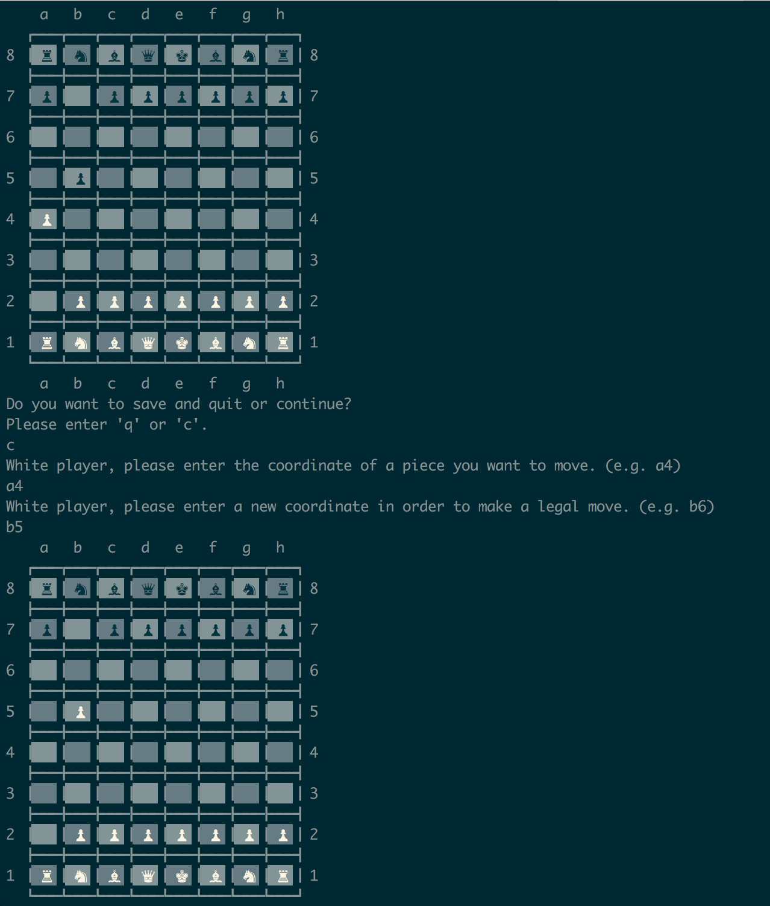
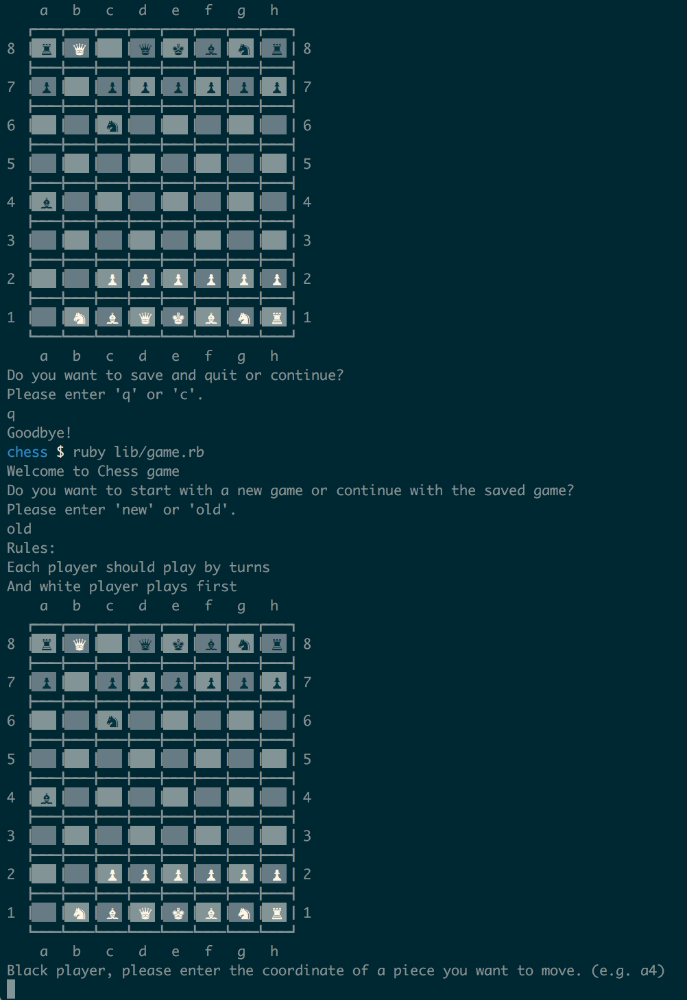
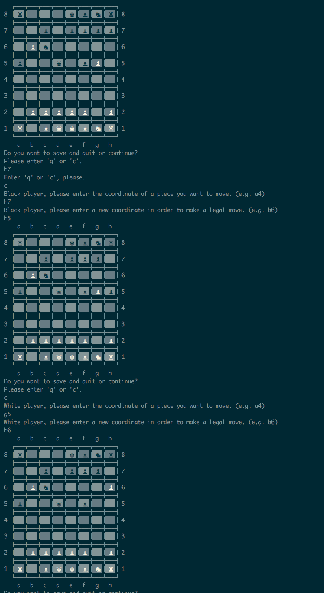
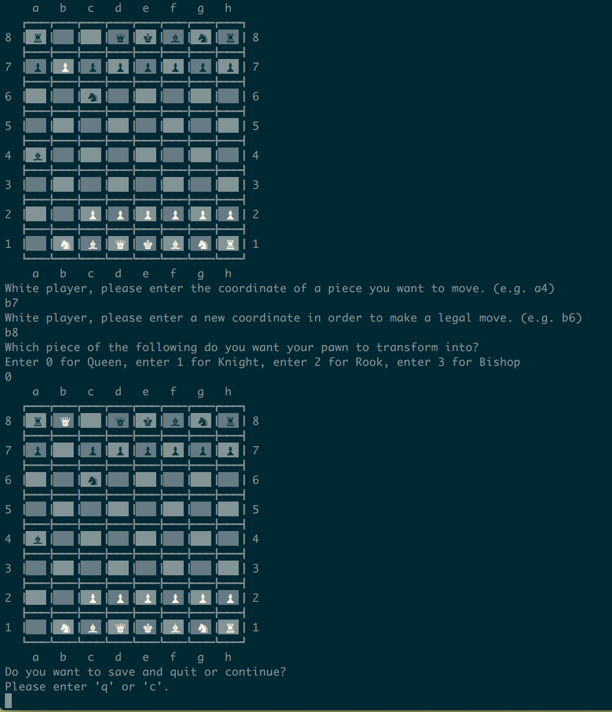
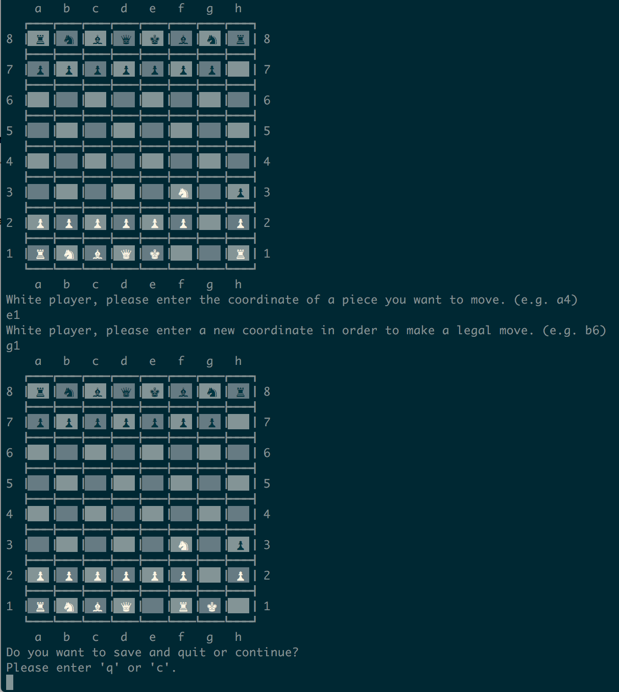
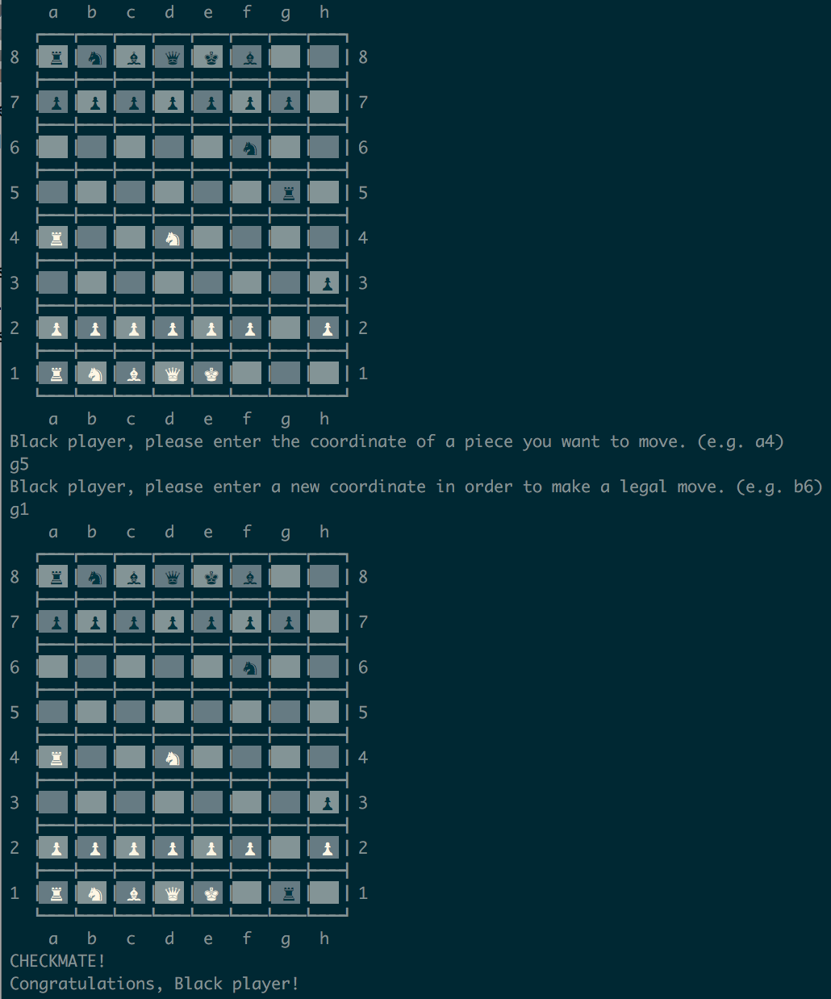
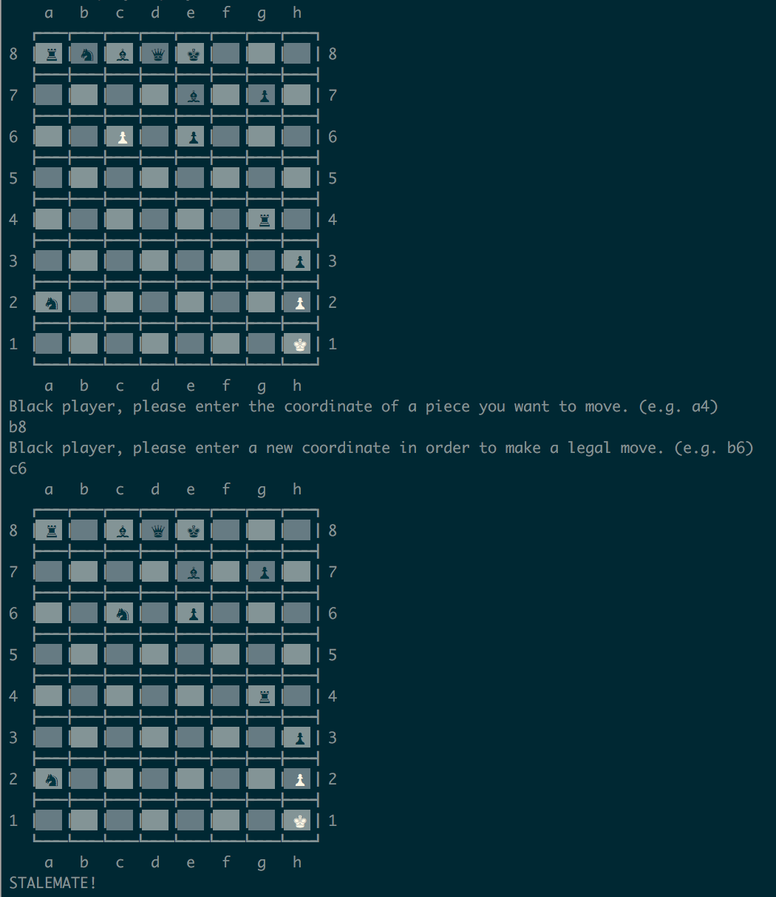

## When start the game

## Each piece has its own move

## Each piece has its own attack

## Each piece has to make a legal move

## Save and Load the game

## En passant

## Pawn Promotion

## Castling

## Check The King

## Checkmate

## Stalemate

